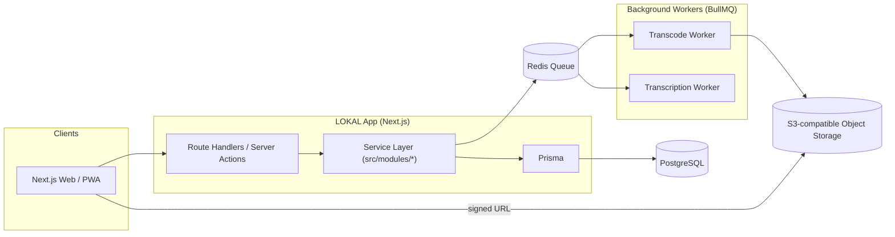
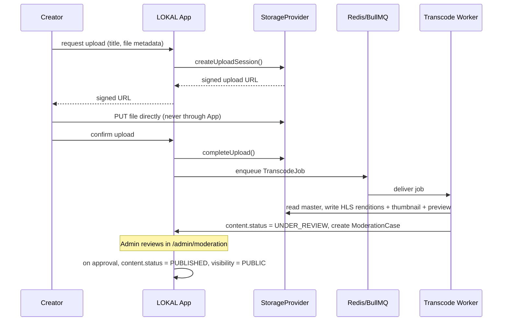

# LOKAL — Architecture

## 1. Overview

LOKAL is built as a **modular monolith**: one Next.js application with clean
internal module boundaries (`route/action → service → Prisma`), so a module
can be extracted into its own service later without a rewrite. Background
work (transcoding, transcription, thumbnailing) runs in a **separate worker
process** (`src/workers/`, started via `pnpm worker`) reading from a
Redis-backed BullMQ queue — never inline in an HTTP request handler.

## 2. Modules

`src/modules/*` — each with a `service.ts` (business logic) and, where user
input is involved, a `schema.ts` (Zod validation):

`auth`, `users`, `organisations`, `channels`, `catalogue`, `media`,
`uploads`, `streaming`, `vault`, `moderation`, `library`, `analytics`,
`admin`.

Routes and Server Actions in `src/app/**` never contain business logic —
they validate input, check authorization via `src/lib/rbac.ts`, call a
module's service function, and handle the HTTP/redirect concern.

## 3. Provider abstractions

`src/lib/providers/` defines an interface + one or more implementations for
every external dependency, selected once via `src/lib/providers/index.ts`
based on environment:

| Interface | Dev implementation | Production implementation |
| --- | --- | --- |
| `StorageProvider` | `LocalFsStorageProvider` (`.data/storage/`, signed via HMAC + `/api/storage/...`) | `S3StorageProvider` (AWS S3, `ap-southeast-5`) |
| `TranscodeProvider` | `LocalFfmpegTranscodeProvider` (shells out to `ffmpeg`) | AWS MediaConvert (implement the interface) |
| `TranscriptionProvider` | `StubTranscriptionProvider` (no-op draft) | AWS Transcribe (Phase 2) |
| `NotificationProvider` | `ConsoleNotificationProvider` (in-app row + console log) | AWS SES/SNS (Phase 2) |
| `PaymentProvider` | `NoopPaymentProvider` (throws — billing is off) | A Malaysian gateway (Phase 3) |
| `SearchProvider` | `PostgresSearchProvider` (ILIKE across title/synopsis/channel/genre) | OpenSearch/semantic (Phase 2+) |

This is what makes "billing/live/AI transcription are schema-ready but
disabled" true in practice: enabling them is "implement + register a
provider," not a redesign.

## 4. Database

See `docs/ERD.md` for the entity-relationship diagram. Full schema:
`prisma/schema.prisma`. Highlights:

- UUID primary keys throughout
- `SubscriptionTier` (FREE/BASIC/PREMIUM/CREATOR/ORGANISATION) exists on
  `User` from day one; `SubscriptionPlan`/`UserSubscription` exist and can be
  populated, but `PaymentProvider.isEnabled()` gates all billing UI
- `Visibility` (PUBLIC/UNLISTED/PRIVATE/MEMBERS_ONLY/ORGANISATION_ONLY/
  SCHEDULED) and `ContentStatus` (DRAFT→UPLOADING→PROCESSING→READY→
  PUBLISHED/SCHEDULED/UNDER_REVIEW/RESTRICTED/TAKEDOWN/ARCHIVED) are
  separate axes, matching Section 2 of the product spec
- `Category`/`Genre`/`Language` are admin-managed tables, never hardcoded
  enums, so taxonomy changes need no deployment (`/admin/categories`,
  `/admin/genres`, `/admin/languages`)
- `HomepageSection`/`HomepageSectionItem` back the entire homepage; an admin
  can add/reorder/hide rows and pick an algorithm (`MANUAL`, `TRENDING`,
  `NEWEST`, `BY_CATEGORY`, `BY_GENRE`, `CONTINUE_WATCHING`, `RECOMMENDED`,
  `FOLLOWED_CHANNELS`, `LIVE_NOW`) from `/admin/homepage`

## 5. Media ingestion pipeline

The browser never uploads large files through the Next.js server — only two
small metadata calls (`requestUpload`, `confirmUpload`) touch it.

## 6. Streaming & playback authorization

`src/modules/streaming/service.ts#getPlaybackPayload` is the single place
that turns a content slug into a playable source. It:

1. Loads the `Content` + its primary `VideoAsset`
2. Enforces `Visibility` rules against the requesting user (or lack thereof)
3. For `PLATFORM` sources, returns a short-lived signed URL to the HLS
   master manifest (never a permanent URL)
4. For `EXTERNAL` sources, returns just the provider + external ID so the
   client renders the official YouTube/Vimeo embed
5. Resolves the user's resume position from `WatchProgress`

## 7. RBAC

`src/lib/rbac.ts` defines the policy layer: `hasRole`, `isAdmin`,
`hasAdminSubRole` (`SUPER_ADMIN`, `CONTENT_ADMIN`, `MODERATOR`,
`SUPPORT_ADMIN`, `FINANCE_ADMIN`, `ORGANISATION_ADMIN`), and composed checks
like `canModerate`/`canCurateHomepage`/`canManageFinance`. Every mutating
Server Action calls `assert(someCheck(user), message)`, which throws
`ForbiddenError` — this is enforced **server-side**, not via hiding UI
elements. `src/middleware.ts` additionally redirects unauthenticated/
unauthorized requests away from `/admin` and `/creator-studio` at the edge,
using an edge-safe subset of the Auth.js config (`src/lib/auth.config.ts`)
that excludes the Argon2id credentials provider, since Argon2's native
bindings can't run in the Edge runtime.

## 8. Phase roadmap

**Phase 1 (this repo):** everything listed in the README's "What's
implemented" section.

**Phase 2:** live streaming (RTMP/SRT ingestion), AI transcription +
subtitle translation, richer ML-backed recommendations, organisation
approval workflow UI, real push notifications, semantic search.

**Phase 3:** billing/PPV, DRM + protected downloads, 4K/HDR/multi-audio,
advertising, smart TV and native app wrappers.
