# LOKAL — Entity Relationship Diagram

Full source of truth: `prisma/schema.prisma`. This is the core-entity slice
for readability — taxonomy, uploads/jobs, and audit tables are omitted here
but follow the same relational shape.

```mermaid
erDiagram
  USER ||--o{ USER_ROLE : has
  ROLE ||--o{ USER_ROLE : grants
  USER ||--|| PROFILE : has
  USER ||--o{ ADMIN_ASSIGNMENT : "admin sub-role"
  USER ||--o{ CHANNEL_SUBSCRIPTION : follows
  USER ||--o{ CHANNEL : owns
  ORGANISATION ||--o{ ORGANISATION_MEMBER : has
  ORGANISATION ||--o{ CHANNEL : owns
  CHANNEL ||--o{ CHANNEL_SUBSCRIPTION : "subscribed by"
  CHANNEL ||--o{ CONTENT : publishes
  CHANNEL ||--o{ SERIES : owns
  SERIES ||--o{ SEASON : has
  SEASON ||--o{ EPISODE : has
  CONTENT ||--o| EPISODE : "is episode of"
  CONTENT ||--o{ VIDEO_ASSET : has
  VIDEO_ASSET ||--o{ SUBTITLE : has
  VIDEO_ASSET ||--o{ AUDIO_TRACK : has
  VIDEO_ASSET ||--o{ VIDEO_RENDITION : has
  VIDEO_ASSET |o--o| LIVE_STREAM : "backed by"
  CONTENT }o--o{ GENRE : tagged
  CONTENT }o--|| CATEGORY : "content type"
  CONTENT }o--|| LANGUAGE : "original language"
  USER ||--o{ WATCH_PROGRESS : tracks
  USER ||--o{ WATCH_HISTORY : has
  USER ||--o{ REACTION : gives
  USER ||--o{ COMMENT : posts
  USER ||--o{ REPORT : files
  CONTENT ||--o{ REPORT : "reported"
  CONTENT ||--o{ MODERATION_CASE : "subject of"
  REPORT ||--o| MODERATION_CASE : opens
  MODERATION_CASE ||--o{ VIOLATION : records
  USER ||--o{ USER_SUBSCRIPTION : holds
  SUBSCRIPTION_PLAN ||--o{ USER_SUBSCRIPTION : defines
  USER ||--o{ UPLOAD_SESSION : initiates
  CHANNEL ||--o{ UPLOAD_SESSION : "targets"
  UPLOAD_SESSION ||--o{ TRANSCODE_JOB : triggers
  VIDEO_ASSET ||--o{ TRANSCODE_JOB : produces
  VIDEO_ASSET ||--o{ TRANSCRIPT_JOB : generates
  USER ||--|| STORAGE_QUOTA : allocated
  USER ||--o{ VAULT_ITEM : owns
  VAULT_ITEM |o--o| CONTENT : "published as"
  USER ||--o{ PLAYLIST : owns
  CHANNEL ||--o{ PLAYLIST : owns
  PLAYLIST ||--o{ PLAYLIST_ITEM : contains
  CONTENT ||--o{ PLAYLIST_ITEM : "included in"
  HOMEPAGE_SECTION ||--o{ HOMEPAGE_SECTION_ITEM : contains
  CONTENT ||--o{ HOMEPAGE_SECTION_ITEM : "featured in"
  CONTENT ||--o{ TICKER : "linked from"
  USER ||--o{ AUDIT_LOG : performs
```

